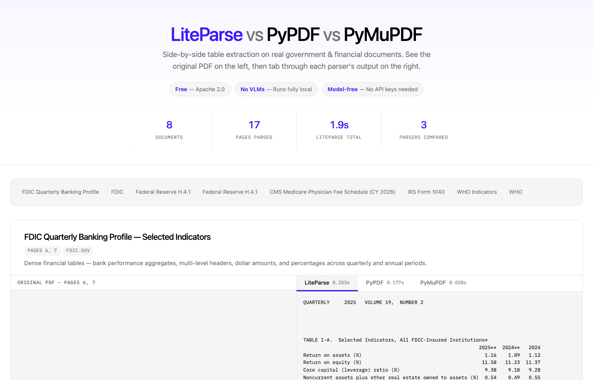
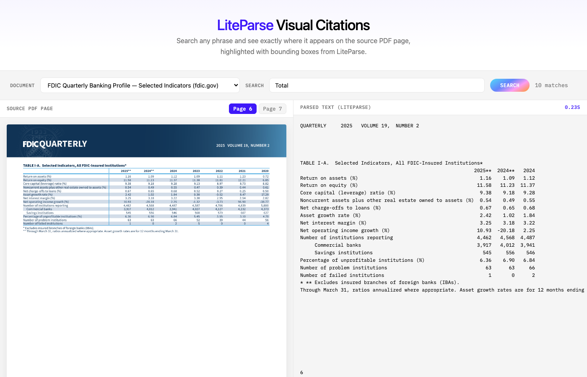
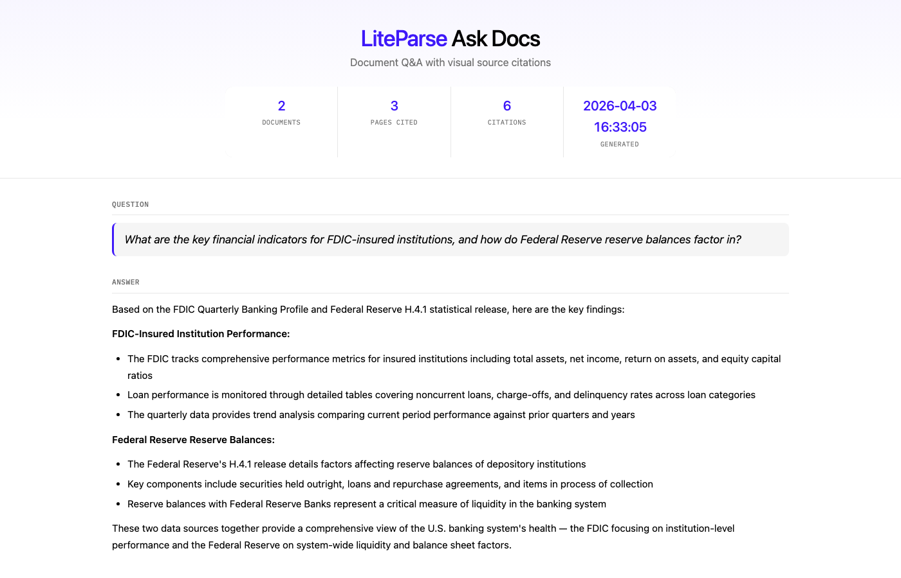

# LiteParse Samples

Interactive demos showcasing [LiteParse](https://developers.llamaindex.ai/liteparse/) — a fast, local, model-free document parser by [LlamaIndex](https://www.llamaindex.ai).

## Samples

### Parser Comparison

Side-by-side comparison of **LiteParse vs PyPDF vs PyMuPDF** on real government and financial documents. See the original PDF on the left, then tab through each parser's extracted text on the right.



**Quick start:** Open [`comparison/output/comparison.html`](comparison/output/comparison.html) in your browser.

**Features:**
- 8 document sections from 5 real-world PDFs (FDIC, Federal Reserve, CMS, IRS, WHO)
- Embedded PDF viewer alongside parsed text
- Per-document timing for each parser

### Visual Citations

Exact keyword search over parsed documents — see precisely where each match appears on the source PDF page, with **bounding boxes** highlighted directly on the page image. This is a simple substring match demo (not fuzzy or RAG-based search). Learn more in the [Visual Citations guide](https://developers.llamaindex.ai/liteparse/guides/visual-citations/).



**Quick start:** Open [`visual_citations/output/visual-citations.html`](visual_citations/output/visual-citations.html) in your browser.

**Features:**
- Interactive keyword search across all documents
- Bounding box overlays on rendered page images
- Side-by-side view of source page and parsed text with highlighted matches

### Ask Docs (Claude Code Skill)

Ask questions about your documents — get answers with **visual source citations**. Install as a [Claude Code](https://claude.com/claude-code) skill and invoke with `/ask-docs`. The skill parses your documents, has Claude answer your question, and generates an HTML report with the answer and cited source pages highlighted with bounding boxes.



**Install:**
```bash
npx skills add run-llama/liteparse_samples --skill ask_docs
```

**Usage:** `/ask-docs ./my-pdfs What is the total revenue?`

**Features:**
- Parse any document LiteParse supports (PDF, DOCX, PPTX, XLSX, images) plus plaintext
- AI-powered answers with exact-quote source citations
- Bounding box highlights on source page images
- PDF viewer toggle for each citation
- Self-contained HTML report

## Regenerating with Your Own Data

1. Add your PDFs to the `data/` folder
2. Edit `docs.json` in the relevant sample folder to configure your documents and pages
3. Install dependencies and run:

```bash
pip install -r requirements.txt

# Regenerate comparison
cd comparison && python generate.py

# Regenerate visual citations
cd visual_citations && python generate.py

# Install ask_docs skill
cp -r ask_docs ~/.claude/skills/ask_docs
# Then use: /ask-docs ./data "Your question here"
```

### docs.json format

Each sample has a `docs.json` that controls which documents and pages are processed:

```json
[
  {
    "name": "My Document Title",
    "file": "my_document.pdf",
    "pages": [0, 1, 2],
    "source": "example.com",
    "desc": "Optional description (comparison only)"
  }
]
```

- **file**: PDF filename (must exist in `data/`)
- **pages**: 0-indexed page numbers to parse
- **source**: Attribution label
- **desc**: Description shown in comparison cards (comparison sample only)

## Data

The included PDFs are publicly available government documents:

| File | Source | Description |
|------|--------|-------------|
| `cms_pfs.pdf` | cms.gov | CMS Medicare Physician Fee Schedule (CY 2026) |
| `fdic_qbp.pdf` | fdic.gov | FDIC Quarterly Banking Profile |
| `fed_h41.pdf` | federalreserve.gov | Federal Reserve H.4.1 Statistical Release |
| `irs_1040.pdf` | irs.gov | IRS Form 1040 — U.S. Individual Income Tax Return |
| `who_indicators.pdf` | who.int | WHO Core Health Indicators |

## Requirements

- Python 3.9+
- Dependencies: `liteparse`, `pypdf`, `pymupdf` (see [requirements.txt](requirements.txt))

```bash
pip install -r requirements.txt
```

## Links

- [LiteParse Documentation](https://developers.llamaindex.ai/liteparse/)
- [LiteParse GitHub](https://github.com/run-llama/liteparse)
- [LlamaIndex](https://www.llamaindex.ai)
